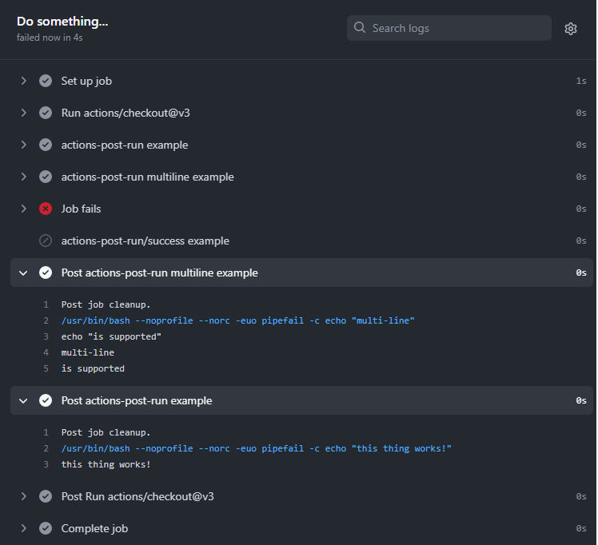

# Post-Run GitHub action

A simple GitHub action that enables running post-run steps, once a workflow job has ended.

## Inputs

### `run`

**Required** A command that needs to be run. Default `echo "This is a post-run step..."`.

## Example usage
Latest version: `3.2.0`

```yaml
name: Build
on:
  push:
    branches: [ master ]
jobs:
  something:
    name: Do something...
    runs-on: ubuntu-latest
    steps:
      - uses: actions/checkout@v2
      - uses: lisanna-dettwyler/action-post-run@3.2.0
        with:
          run: echo "this thing works!"
      - uses: lisanna-dettwyler/action-post-run@3.2.0
        with:
          run: |
            echo "multi-line"
            echo "is supported"
          # working-directory: not-required-but-you-can-provide-it
      - name: Job fails
        run: false
      - uses: lisanna-dettwyler/action-post-run/success@3.2.0
        with:
          run: echo "this only runs if the job succeeded (post-if: 'success()'"
name: Build
on:
  push:
    branches: [ master ]
jobs:
  something:
    name: Do something...
    runs-on: ubuntu-latest
    steps:
      - uses: actions/checkout@v3
      - name: actions-post-run example
        uses: lisanna-dettwyler/action-post-run@3.2.0
        with:
          run: echo "this thing works!"
      - name: actions-post-run multiline example
        uses: lisanna-dettwyler/action-post-run@3.2.0
        with:
          run: |
            echo "multi-line"
            echo "is supported"
          # working-directory: not-required-but-you-can-provide-it
      - name: Job fails
        run: false
      - name: actions-post-run/success example
        uses: lisanna-dettwyler/action-post-run/success@3.2.0
        with:
          run: |
            echo "this only runs if the job succeeded (post-if: 'success()'"

```

This above configuration will produce the following:



> **Note** Note the order of execution. The multiline example was executed before the first example.
